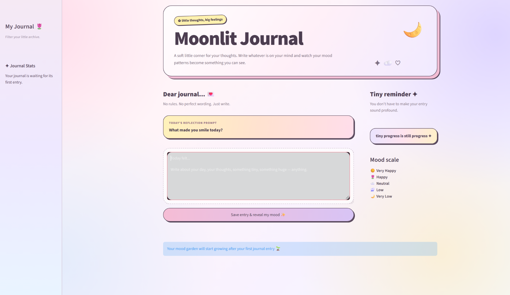
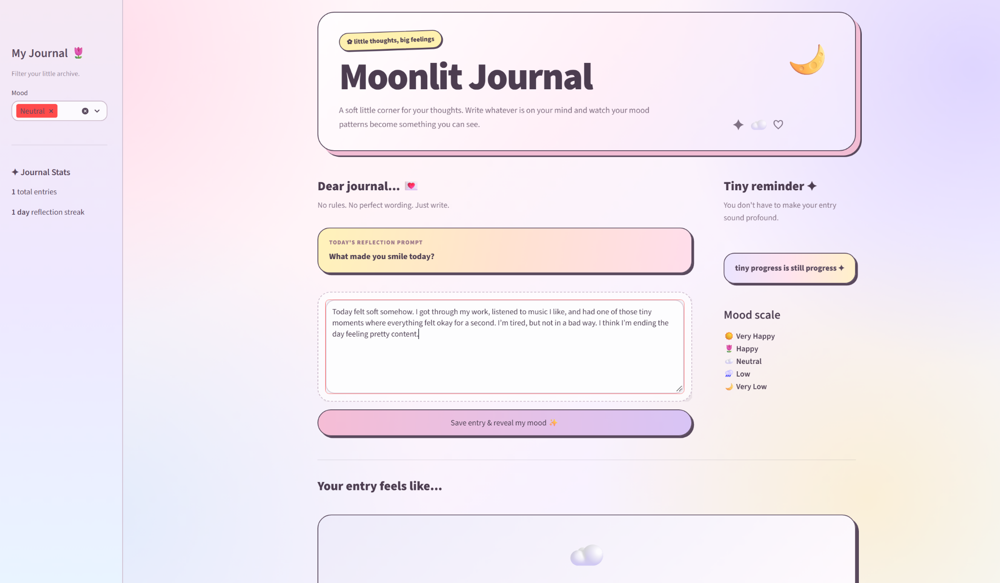
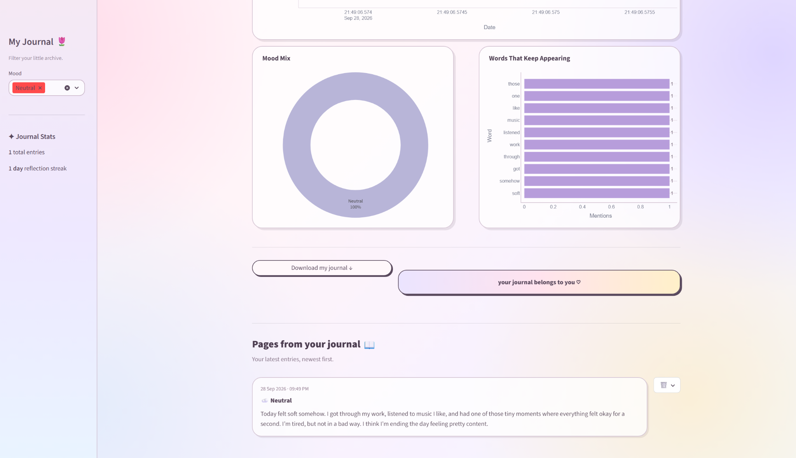
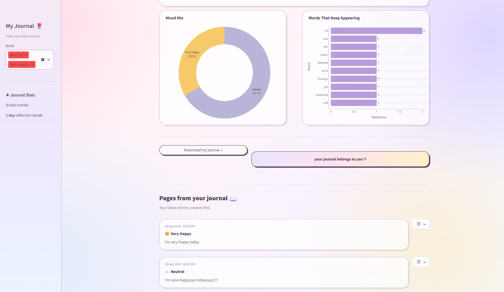

# 🌙 Moonlit Journal

Moonlit Journal is a dreamy AI-powered journaling app that turns personal reflections into visual mood insights.

Users can write journal entries, receive a sentiment-based mood result, track mood patterns over time, explore recurring words, filter journal history by mood, and download their journal data — all inside a Streamlit interface.

---

## ✨ App Preview

### Home

A soft space for writing, reflecting, and checking in with yourself.



### Writing an Entry

Users can write freely using the daily reflection prompt as inspiration.



### Mood Result

After saving an entry, the app analyzes the text and maps it to a mood category.


### Mood Analysis

Each entry generates a mood score, sentiment score, and emotional intensity value.



### Happy Entry Example

The same journal flow can capture different emotional tones.


### Happy Mood Result

Positive entries are reflected visually through the mood card and score.


### Mood Garden & Visualizations

Mood history, mood distribution, recurring words, journal statistics, and saved entries help users explore patterns across their journal.



---

## 🌷 Features

- Write and save journal entries
- Daily reflection prompts
- Daily affirmations
- Automatic sentiment analysis
- Mood classification
- Mood score from 1 to 5
- Sentiment polarity score
- Emotional intensity / subjectivity score
- Mood history over time
- Mood distribution visualization
- Recurring word analysis
- Journal entry count
- Average mood score
- Most common mood
- Reflection streak tracking
- Filter journal history by mood
- View saved journal entries
- Delete individual entries
- Download journal history as CSV
- Local data storage
- Dreamy pastel Streamlit interface
- Rounded cards, charts, controls, and journal sections

---

## 🎭 Mood Scale

| Mood | Emoji | Score |
|---|---:|---:|
| Very Happy | ☀️ | 5 |
| Happy | 🌷 | 4 |
| Neutral | ☁️ | 3 |
| Low | 🌧️ | 2 |
| Very Low | 🌙 | 1 |

---

## 🧠 How It Works

Moonlit Journal uses **TextBlob** to analyze the sentiment of each journal entry.

For every entry, the app calculates:

- **Polarity** — how positive or negative the text is
- **Subjectivity** — how opinion-based or emotionally expressive the text is

The polarity score is mapped into one of five mood categories:

- Very Happy
- Happy
- Neutral
- Low
- Very Low

Each mood is given a numeric score from **1 to 5**, which allows mood history to be plotted over time.

The app stores journal entries locally in a CSV file and reloads them whenever the app is opened.

---

## 📊 Mood Visualizations

The app includes several interactive visualizations:

### Mood Over Time

Shows how mood scores change across journal entries.

### Mood Mix

Displays the distribution of saved moods in a donut chart.

### Words That Keep Appearing

Highlights frequently used words across journal entries.

### Journal Statistics

Displays:

- total journal entries
- average mood score
- most common mood
- reflection streak

---

## 🛠️ Tech Stack

- Python
- Streamlit
- Pandas
- Plotly
- TextBlob
- CSV-based local storage

---

## 📁 Project Structure

```text
ai-journal-mood-visualizer/
│
├── data/
│   └── journal_entries.csv
│
├── images/
│   ├── journal_home_empty.png
│   ├── journal_home_written.png
│   ├── journal_neutral_result.png
│   ├── journal_neutral_analysis.png
│   ├── journal_happy_written.png
│   ├── journal_happy_result.png
│   └── journal_mood_charts.png
│
├── app.py
├── README.md
├── requirements.txt
└── .gitignore
```

---

# 🚀 How to Run

## 1. Clone the repository

## 2. Move into the project folder

```bash
cd ai-journal-mood-visualizer
```

## 3. Create a virtual environment

```bash
python -m venv .venv
```

## 4. Activate the virtual environment

For Windows PowerShell:

```powershell
Set-ExecutionPolicy -Scope Process -ExecutionPolicy Bypass
.\.venv\Scripts\Activate.ps1
```

## 5. Install the required packages

```bash
pip install -r requirements.txt
```

## 6. Launch the Streamlit app

```bash
streamlit run app.py
```

The application will open in your browser.

---

# 💌 How to Use

1. Launch the application.

2. Read the daily reflection prompt if you want inspiration.

3. Write anything you would like in the journal text box.

4. Click:

```text
Save entry & reveal my mood ✨
```

5. Review the mood result generated from the entry.

6. Explore:
   - Mood Score
   - Sentiment Score
   - Emotional Intensity

7. Scroll to the **Mood Garden** section to view:
   - total journal entries
   - average mood
   - most common mood
   - reflection streak

8. Explore the **Mood Over Time** chart.

9. Review the **Mood Mix** donut chart.

10. Explore recurring words in **Words That Keep Appearing**.

11. Use the sidebar to filter journal history by mood.

12. Scroll to **Pages from your journal** to review previous entries.

13. Use the trash icon to delete an entry.

14. Use **Download my journal** to export your journal history as a CSV file.

---

## 💾 Data Storage

Journal entries are stored locally in:

```text
data/journal_entries.csv
```

Each saved entry contains:

- Entry ID
- Date
- Journal text
- Mood
- Mood Score
- Sentiment Polarity
- Subjectivity

The data remains available after restarting the application unless the CSV file is deleted.

---

## 📌 Sentiment Analysis Note

Moonlit Journal uses TextBlob for lightweight sentiment analysis.

The generated mood is an interpretation of the emotional tone of the text and should not be treated as a diagnosis or a definitive assessment of how someone feels.

The app is designed as a reflective and visual journaling tool.

---

## 💡 What I Practiced

This project helped me practice:

- Natural language processing
- Sentiment analysis
- Text processing
- Streamlit application development
- Interactive data visualization
- Plotly charts
- Pandas data handling
- Local file storage
- CRUD-style application features
- Session state
- Filtering
- CSV export
- UI/UX design
- Building an end-to-end interactive application

---

## 🌱 Future Improvements

Possible improvements include:

- More advanced emotion classification
- Multi-emotion detection
- Journal search
- Calendar-based journal browsing
- Monthly mood summaries
- Custom journal themes
- Tagging journal entries
- Editing previous entries
- Password-protected journal storage
- Cloud database integration
- Exporting journal summaries as PDF
- More advanced NLP theme detection

---

## 💕 About the Project

Moonlit Journal was built as a playful NLP and data visualization project combining journaling, sentiment analysis, mood tracking, and interactive design.

The goal was to create something that feels personal and visually engaging while also demonstrating practical Python, NLP, data handling, and Streamlit development skills.
